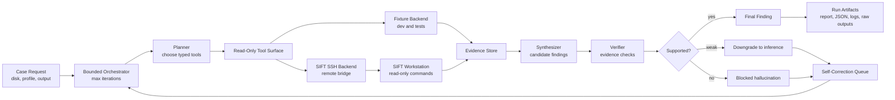

# Architecture

## Diagram

## Core Loop
CaseTrace runs these phases:
- `intake`
- `plan`
- `collect`
- `synthesize`
- `verify`
- `self_correct`
- `finalize`

The orchestration loop is bounded by `--max-iterations`.

## Guardrails
- No generic shell execution is exposed to the agent.
- Tools are typed and read-only.
- Tool output is copied into run-local artifacts for auditability.
- Unsupported claims are blocked during verification.
- The remote backend calls [scripts/sift_tool_bridge.py](../scripts/sift_tool_bridge.py), not arbitrary user-provided shell.
- The orchestrator exits at `--max-iterations` even when verification still wants more evidence.

## Trust Boundaries
- Prompt guardrail: the reasoning layer is instructed to avoid unsupported claims.
- Architectural guardrail: the agent can only request named tools exposed by CaseTrace.
- Architectural guardrail: remote SIFT access is limited to bridge commands with fixed arguments.
- Audit boundary: every final finding must reference evidence IDs written to the run folder.

## Tool Surface
Current v1 tools:
- `case_info`
- `mount_image_readonly`
- `timeline_mft`
- `prefetch_summary`
- `amcache_summary`
- `registry_autoruns`
- `scheduled_tasks`
- `user_logons`
- `browser_history`
- `yara_scan`

Optional phase-2 placeholders:
- `vol_process_tree`
- `vol_netscan`

## Evidence Model
Each tool execution returns:
- structured JSON records
- provenance metadata
- evidence IDs
- a raw artifact path
- a confidence score

Findings point back to `evidence_ids`, and evidence points back to the originating tool artifact.
